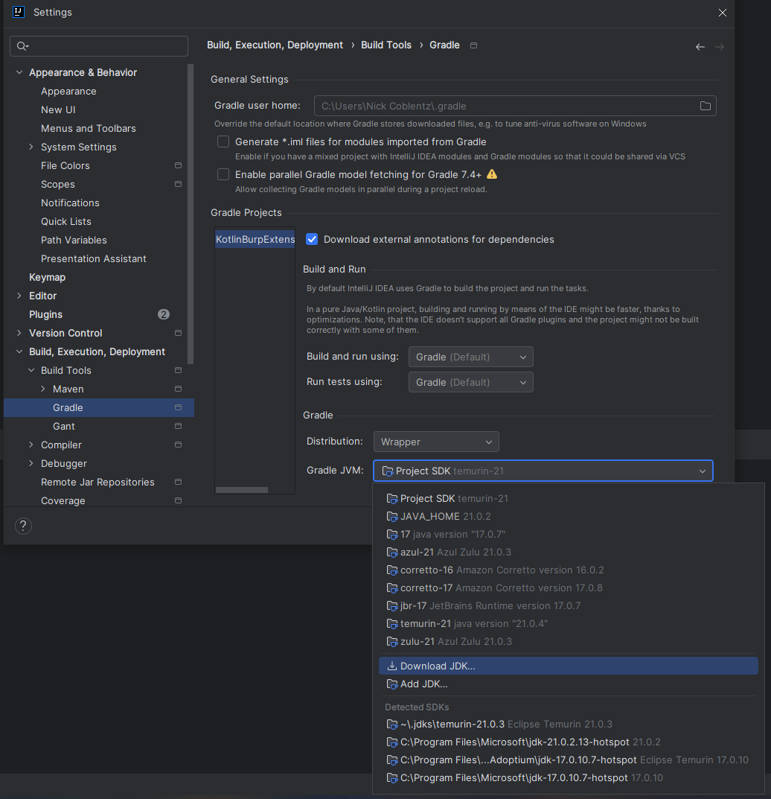
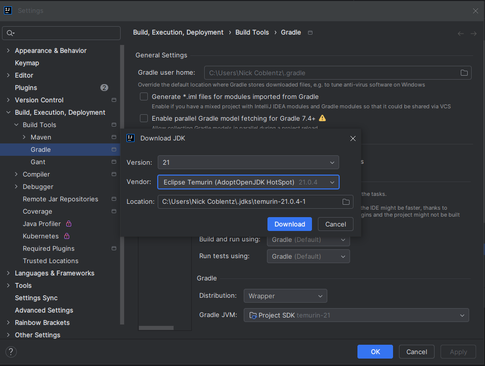
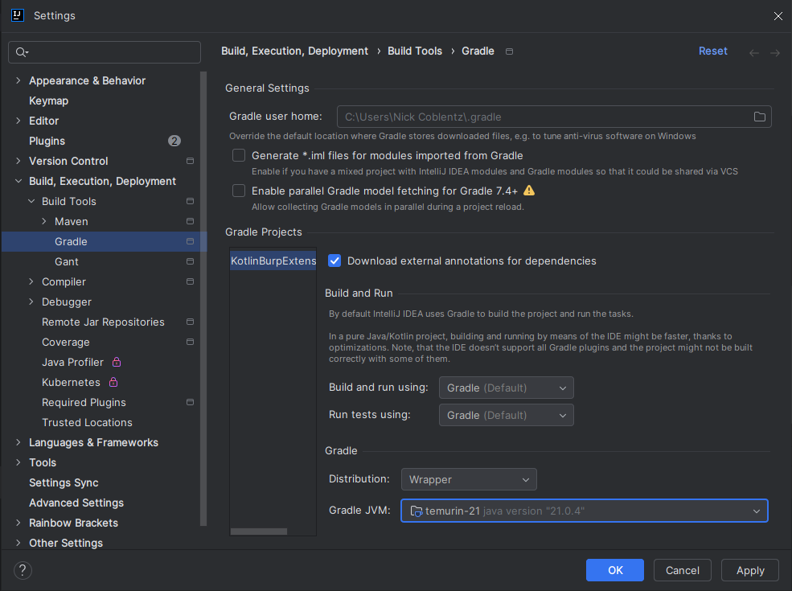
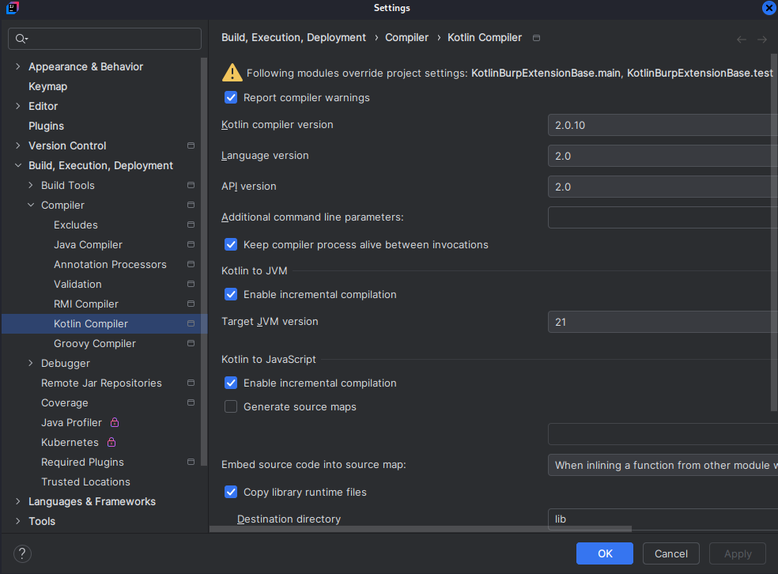

# Your Kotlin Burp Extension Name Here!

This project provides the starting point for building a Burp Extension in Kotlin using the Montoya API. Replace this paragraph with a description of your plugin.

## Setup Steps

### Intellij

Be sure to configure the following settings in Intellij by choosing `File -> Settings`

#### Setup Gradle: Download a Java 21+ JDK

### Configure Kotlin to use 2.x

### Project

#### Gradle Settings

1. In `build.gradle.kts`, change `group = "com.yourname.montoya"` to reflect your name or company
2. In `settings.gradle.kts` change `rootProject.name = "KotlinBurpExtensionBase"` to the name of your extension/project

### How to Build a Project

When you want to produce a Burp suite extension, you will need to build a jar that includes any external libraries and related Kotlin libraries. Build a plugin at the command line with:
Linux: `gradlew shadowJar`
Windows: `gradlew.bat shadowJar`

Within IntelliJ, Click the Elephant Symbol on the far right hand bar and visit `Tasks -> shadow -> shadowJar`

A `projectname-x.y.z.all.jar` file will be produced in `build/libs/` where `x.y.z` is the version number from `build.gradle.kts`. Add this to Burp Suite by:
1. Open Burp Suite
2. Click the "Extensions" tab
3. Click "Add"
4. For "Extension Type", choose "Java"
5. Click the "Select File" button, and choose the `projectname-x.y.all.jar` from above

